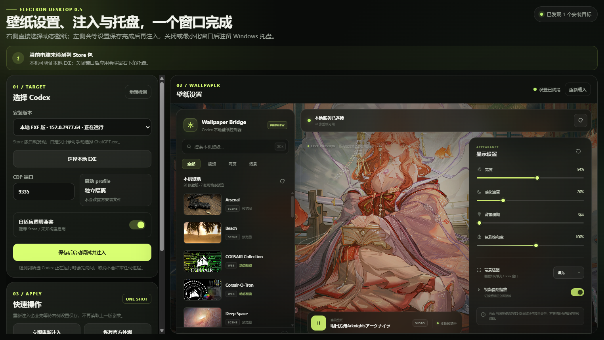
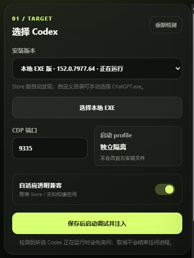
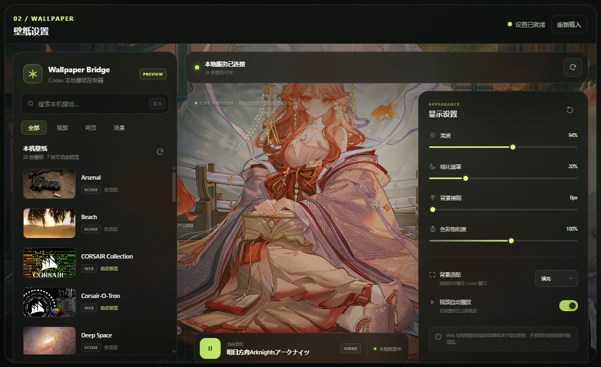

# Codex Wallpaper Desktop

Codex Wallpaper Desktop 是一个 Windows 桌面工具：它把本机 Wallpaper Engine 项目作为 Codex 的窗口背景，并在一个界面里完成壁纸选择、实时预览、显示效果调整、Codex 调试启动、一次性注入和官方外观恢复。

它同时适配 Microsoft Store 版 Codex 和用户选择的本地 `ChatGPT.exe`，不会替换或修改 Codex 安装目录中的文件。项目可以独立克隆、运行和打包；仓库已经包含所需的 `bridge-runtime/`，不依赖仓库外的父目录。

## 它具体能做什么

- 扫描本机 Wallpaper Engine 项目，支持图片、视频、网页和场景壁纸的选择与预览。
- 自动发现 Store 版 Codex，也可手动选择其他目录中的本地 EXE。
- 以独立 profile 和仅监听 `127.0.0.1` 的 CDP 端口启动 Codex，不改官方配置文件。
- 把壁纸、亮度、暗化遮罩、模糊、饱和度和适配方式一次性注入当前 Codex renderer。
- 自动清理 Store/本地不同构建中的不透明背景和大型模糊壳层，让壁纸保持清晰可见。
- 大视频使用 8 MiB 分块和最多 3 路流水传输；高速路径失败时自动切换兼容模式并显示进度。
- 关闭或最小化控制窗口后驻留 Windows 托盘；也可完全退出，当前 Codex 窗口中的已注入效果仍会保留。
- 随时执行“恢复官方外观”，清理壁纸节点、透明兼容样式和运行时状态。

简单来说，它不是修改 Codex 安装包的“永久补丁”，而是一个可恢复的桌面注入控制器。Codex 重启、硬刷新或 renderer 重建后需要重新注入。

## 工作方式

1. 在右侧壁纸面板选择本地 Wallpaper Engine 壁纸并调整显示参数。
2. 在左侧选择 Store 或本地 Codex；如果目标正在普通模式运行，软件会先询问是否关闭。
3. 软件等待壁纸设置保存完成，再以隔离调试 profile 启动 Codex 并执行一次性注入。
4. 注入结束后无需保持注入进程运行；需要修改、恢复或重新注入时再打开本软件。

## 运行效果

### 一体化控制台

目标选择、注入操作、壁纸库和显示设置集中在同一个窗口。



### Codex 启动与一次性注入

选择 Store/本地 EXE、设置 CDP 端口和透明兼容模式，然后保存设置并自动启动注入。



### 壁纸库、实时预览与显示设置

直接浏览本地壁纸、预览动态效果，并调整亮度、暗化、模糊、饱和度和适配方式。



## 下载

从 [GitHub Releases](https://github.com/whisperia6/codex-wallpaper-bridge/releases/latest) 下载 `CodexWallpaperDesktop.exe`，无需安装，双击即可运行。

## 首次安装依赖

```powershell
npm ci
```

依赖、构建目录、单文件 EXE、截图、日志、备份、环境变量和个人工作记录均已通过 `.gitignore` 排除，不应提交到 GitHub。

## 最简单启动

双击 `run-electron.cmd`，或执行：

```powershell
npm start
```

首次启动后：

1. Store 版会自动显示在“安装版本”中；自定义目录版点击“选择本地 EXE”。
2. 直接在同一窗口右侧选择壁纸并调参数，不再打开第二个窗口。
3. 点“保存后启动调试并注入”。左侧会等待右侧最近一次选择和效果参数写入完成，避免拿到旧配置或静态预览。
4. 如果选定 Codex 正在普通模式运行，桌面版会先询问是否关闭；请保存尚未发送的输入，再选“关闭并继续”。取消弹窗不会关闭任何进程。
5. 桌面版按所选可执行文件的完整路径关闭对应 Codex、以调试模式重新启动，并在 CDP 就绪后自动完成一次性注入。
6. 最小化或关闭主窗口后应用驻留 Windows 右下角托盘；双击托盘图标可恢复窗口，右键可打开设置、注入、恢复或彻底退出。
7. Codex 重启、renderer 重建或硬刷新后需要重新注入；点“恢复官方外观”可完整清理。

## 托盘与一次性注入的关系

- 托盘驻留的是 Electron 控制器和右侧本地设置页，用于随时调整或再次注入。
- 壁纸注入本身仍是一次性的：注入命令结束后，当前 Codex renderer 不依赖桥接注入进程。
- 从托盘选择“退出”后，当前 Codex 窗口的皮肤仍会保留；下次想修改时再启动本软件即可。
- 只有 Codex 重启、硬刷新或 renderer 重建才需要重新注入。

## 两种版本如何适配

- 安装层：Store 版通过 `Get-AppxPackage -Name OpenAI.Codex` 发现，本地版支持运行进程发现和手动选择 EXE。
- 启动层：两者都以 `127.0.0.1` CDP 端口和各自独立 profile 启动，不修改安装目录。
- 展示层：先运行现有壁纸桥，再按 renderer 的语义 `data-*`、旧/新哈希类名和受限几何特征安装兼容透明层，因此不依赖“Store / EXE”标签硬编码样式。Store 新壳层即使背景本身透明、只通过 `backdrop-filter` 模糊壁纸，也会被自适应层识别并清除滤镜。
- 大视频层：32 MiB 以上、512 MiB 以内的视频默认采用 8 MiB、最多 3 路 CDP 流水传输；高速路径失败会自动清理并退回 2 MiB 串行模式，顶部状态会显示 MiB 与百分比进度。Codex renderer 组装出 `blob:` URL 后无需保持桥接进程运行。
- 同步层：内嵌控制页会跟踪配置写入；启动和重新注入前必须收到“设置已同步”，保存失败会阻止注入。
- 桌面层：控制页与启动器合并为一个窗口；关闭或最小化后驻留系统托盘。
- 诊断层：另一台 Store 电脑可点“导出 JSON”。报告不采集对话正文，只记录版本、选择器命中、大型表面背景/滤镜摘要，以及壁纸媒体的标签、来源类型、分辨率、播放状态和实际滤镜。

## 构建 Windows 单文件版

双击 `make-electron.cmd`，或执行：

```powershell
npm run make
```

产物为 `out\release-<版本号>\CodexWallpaperDesktop.exe`，无需安装和解压，直接双击即可。每个版本目录只保留这一个 EXE；旧版本 ZIP 和正在运行的旧版不会被覆盖。

发布链会先用 esbuild 编译压缩，再对主进程、注入运行时和浏览器脚本做保守混淆，最后写入带完整性校验的 `app.asar`，不会再发布 `resources\app\src`、`bridge-overrides`、测试文件或 source map。单文件启动时仍会把 Electron 运行组件临时解包到系统目录；ASAR、混淆和完整性校验只能提高逆向与篡改成本，不能保证绝对无法分析。

当前没有配置代码签名证书，因此 Windows 仍可能显示未知发布者或 SmartScreen 提示。配置合法的 Windows 签名凭据后，electron-builder 可在同一发布链中签名最终产物。

## 测试

```powershell
npm test
```

测试覆盖安装归一化、端口校验、运行中取消/确认关闭、保存握手、同窗控制页、托盘菜单与生命周期、大视频 Blob 传输、自动注入顺序、兼容层安装/恢复和现有 CLI 契约。
