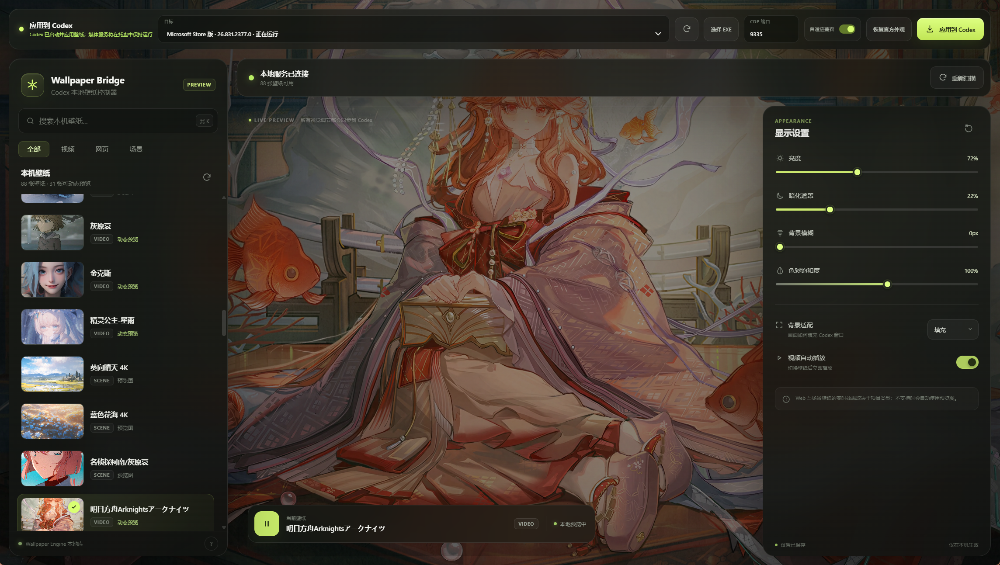
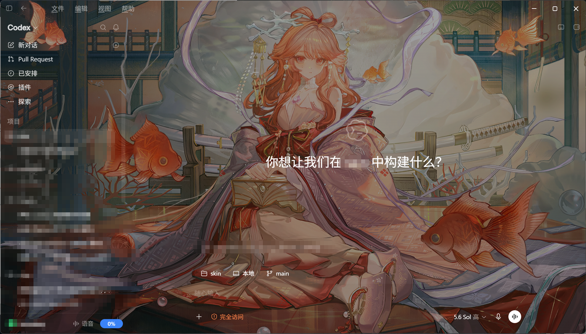

# Codex Wallpaper Desktop

> 当前分支是 `0.6.0-alpha.2` 的 **1 秒级流式注入实验版**。稳定版仍为 v0.5.1；架构取舍和限制见 [实验说明](docs/one-second-injection-experiment.md)。

Codex Wallpaper Desktop 是一个 Windows 桌面工具：它把本机 Wallpaper Engine 项目作为 Codex 的窗口背景，并在一张壁纸工作台里完成壁纸选择、实时预览、显示效果调整、Codex 目标选择、应用和官方外观恢复。

它同时适配 Microsoft Store 版 Codex 和用户选择的本地 `ChatGPT.exe`，不会替换或修改 Codex 安装目录中的文件。项目可以独立克隆、运行和打包；仓库已经包含所需的 `bridge-runtime/`，不依赖仓库外的父目录。

## 它具体能做什么

- 扫描本机 Wallpaper Engine 项目，支持图片、视频、网页和场景壁纸的选择与预览。
- 自动发现 Store 版和已注册安装、开始菜单快捷方式或常见目录中的本地 Codex；无法定位的便携版仍可手动选择 EXE。
- 以独立 profile 和仅监听 `127.0.0.1` 的 CDP 端口启动 Codex，不改官方配置文件。
- 把轻量 Runtime 和壁纸配置注入当前 Codex renderer，不再通过 CDP 传输完整媒体文件。
- 自动清理 Store/本地不同构建中的不透明背景和大型模糊壳层，让壁纸保持清晰可见。
- 大视频通过随机 token 保护的本机 HTTP Range 服务按需读取，文件大小不再进入注入 payload。
- 关闭或最小化控制窗口后驻留 Windows 托盘，维持媒体流、页面重载恢复和新 renderer 自动接入。
- 随时执行“恢复官方外观”，清理壁纸节点、透明兼容样式和运行时状态。

简单来说，它不是修改 Codex 安装包的“永久补丁”，而是一个可恢复的桌面注入控制器。只要实验版仍驻留托盘，Codex 硬刷新或 renderer 重建后会自动恢复；完全退出实验版后，本机媒体流会停止。

## 工作方式

1. 在壁纸工作台选择本地 Wallpaper Engine 壁纸并调整显示参数。
2. 在工作台顶部选择 Store 或本地 Codex；如果目标正在普通模式运行，软件会先询问是否关闭。
3. 点击“应用到 Codex”。软件先等待壁纸设置保存完成；已有调试端点时直接重新应用，否则以隔离调试 profile 启动 Codex 后注入轻量 Runtime 和配置。
4. Runtime 在 Codex 背景层创建一个轻量 `srcdoc` 媒体子页面；图片、视频和网页资源由该子页面从常驻托盘进程的 loopback 服务按需读取。

## 运行效果

### 一体化控制台

目标选择、注入操作、壁纸库和显示设置集中在同一个窗口。



### 实际展示效果



## 下载

GitHub Release 目前仍是稳定版 v0.5.1，不包含本实验架构。实验版请在当前分支执行 `npm ci`、`npm start`；验证完成后再单独生成 alpha EXE。

## 首次安装依赖

```powershell
npm ci
```

依赖、构建目录、单文件 EXE、截图、日志、备份、环境变量和个人工作记录均已通过 `.gitignore` 排除，不应提交到 GitHub。

## 最简单启动

双击 `run-electron.cmd`，或执行：

```powershell
npm start
```

首次启动后：

1. Store 版和正常注册/创建开始菜单快捷方式的本地版会自动显示在“安装版本”中；仅未注册且没有快捷方式的便携版需要点击“选择本地 EXE”。手动选择结果会保存，后续启动无需重复选择。
2. 直接在同一张壁纸工作台选择壁纸并调参数，不再打开第二个窗口，也没有单独的日志/诊断侧栏。
3. 在顶部选择目标并点“应用到 Codex”。软件会等待最近一次选择和效果参数写入完成，避免拿到旧配置或静态预览。
4. 如果选定 Codex 正在普通模式运行，桌面版会先询问是否关闭；请保存尚未发送的输入，再选“关闭并继续”。取消弹窗不会关闭任何进程。
5. 桌面版按所选可执行文件的完整路径关闭对应 Codex、以调试模式重新启动，并在 CDP 就绪后自动完成快速流式注入。
6. 最小化或关闭主窗口后应用驻留 Windows 右下角托盘；双击托盘图标可恢复窗口，右键可打开设置、应用、恢复、打开本地日志目录或彻底退出。
7. 托盘仍运行时，Codex renderer 重建或硬刷新会自动恢复；点“恢复官方外观”可完整清理。

## 托盘与流式注入的关系

- 托盘驻留 Electron 控制器、本机媒体服务和 CDP session，用于 Range 流式播放、设置同步与自动恢复。
- “注入完成”只表示 Runtime 和背景 DOM 已就绪；视频首帧仍受磁盘、编码和关键帧位置影响。
- 最小化或关闭主窗口不会中断播放；从托盘彻底退出会停止本机媒体服务，动态壁纸将无法继续请求新数据。
- 不使用实验版时，建议先点“恢复官方外观”再退出。

## 两种版本如何适配

- 安装层：Store 版通过 `Get-AppxPackage -Name OpenAI.Codex` 发现；本地版会从卸载注册信息、开始菜单快捷方式、常见安装目录和运行进程自动发现，手动选择仅作为便携版兜底。
- 启动层：两者都以 `127.0.0.1` CDP 端口和各自独立 profile 启动，不修改安装目录。
- 展示层：先运行现有壁纸桥，再按 renderer 的语义 `data-*`、旧/新哈希类名和受限几何特征安装兼容透明层，因此不依赖“Store / EXE”标签硬编码样式。Store 新壳层即使背景本身透明、只通过 `backdrop-filter` 模糊壁纸，也会被自适应层识别并清除滤镜。
- 大视频层：CDP 仅发送小于 100 KiB 的 Runtime 和小于 10 KiB 的配置；受控 `srcdoc` 子页面直接读取随机 token 保护的 `127.0.0.1` Range 服务，不设置 512 MiB 上限。
- 同步层：内嵌控制页会跟踪配置写入；“应用到 Codex”前必须收到保存完成信号，保存失败会阻止注入。
- 桌面层：Codex 目标与应用操作直接集成到壁纸工作台；关闭或最小化后驻留系统托盘。
- 诊断层：运行日志按日期写入 `%LOCALAPPDATA%\CodexWallpaperDesktop\logs`，会话 URL 会自动脱敏；应用失败时同目录自动生成兼容诊断 JSON。界面不展示日志和诊断正文。

## 构建 Windows 单文件版

双击 `make-electron.cmd`，或执行：

```powershell
npm run make
```

产物为 `out\release-<版本号>\CodexWallpaperDesktop.exe`，无需安装和解压，直接双击即可。每个版本目录只保留这一个 EXE；旧版本 ZIP 和正在运行的旧版不会被覆盖。

程序按当前用户权限运行（`asInvoker`），正常使用不需要管理员权限。只有目标 Codex 本身已经“以管理员身份运行”时，普通权限进程无法将它关闭；这种情况下先退出该 Codex，再由本程序启动即可，不建议日常把本程序设置为管理员运行。

发布链会先用 esbuild 编译压缩，再对主进程、注入运行时和浏览器脚本做保守混淆，最后写入带完整性校验的 `app.asar`，不会再发布 `resources\app\src`、`bridge-overrides`、测试文件或 source map。单文件启动时仍会把 Electron 运行组件临时解包到系统目录；ASAR、混淆和完整性校验只能提高逆向与篡改成本，不能保证绝对无法分析。

当前没有配置代码签名证书，因此 Windows 仍可能显示未知发布者或 SmartScreen 提示。配置合法的 Windows 签名凭据后，electron-builder 可在同一发布链中签名最终产物。

## 测试

```powershell
npm test
```

测试覆盖安装归一化、端口校验、运行中取消/确认关闭、单一应用入口、保存握手、单工作台消息桥、本地日志脱敏、托盘生命周期、Runtime/apply 拆分、子页面媒体桥与 URL 边界、HTTP Range 206/416、媒体大小无关 payload、自动注入顺序和兼容层恢复。性能基准可执行 `npm run benchmark:injection`。
